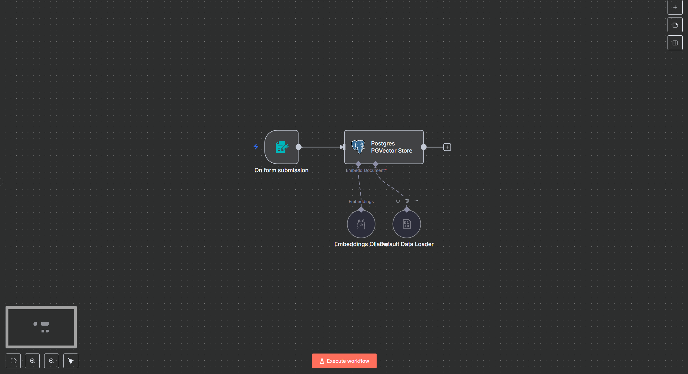
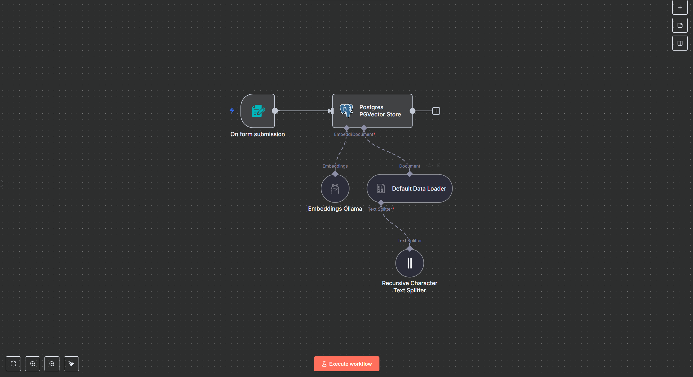
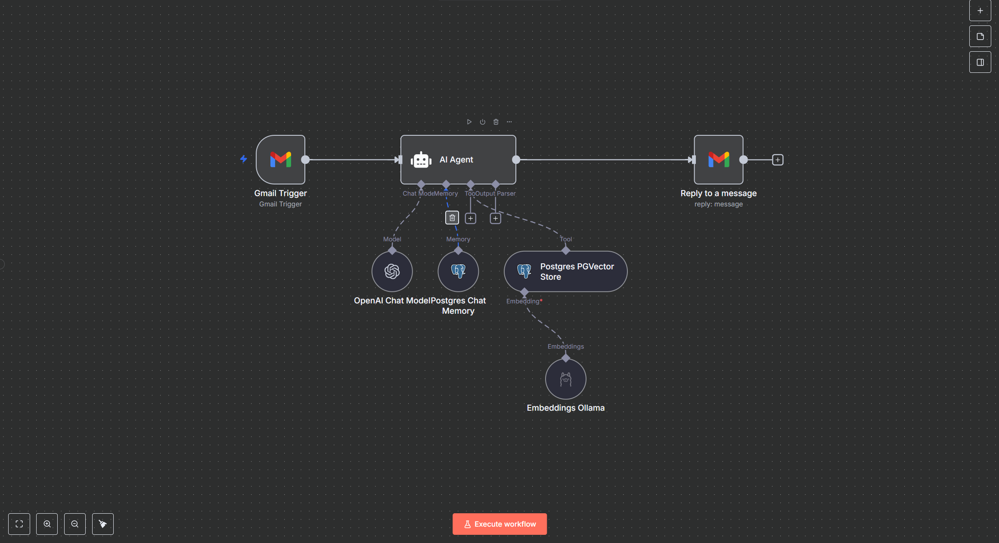
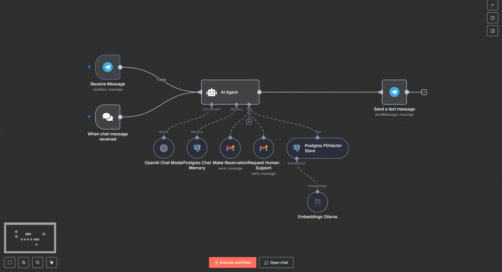
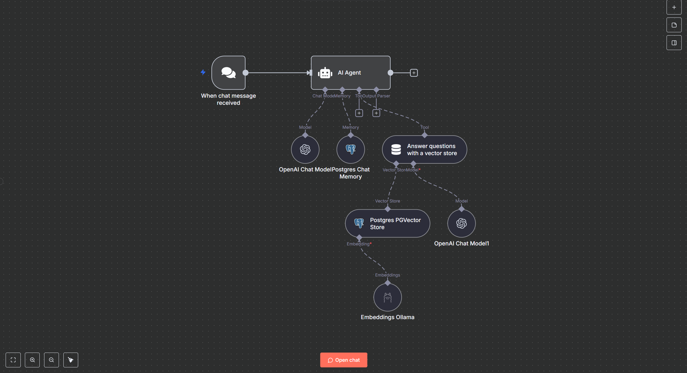
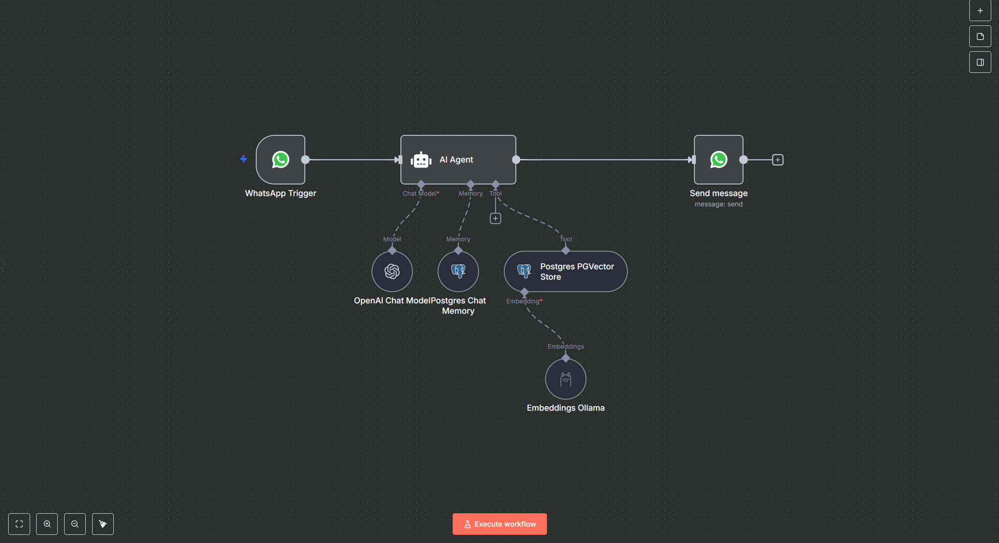

<h1 align="center">n8n Workflows</h1>
<p align="center"><i>A curated library of n8n workflows — starting with chatbot automation and expanding into diverse automation use cases.</i></p>

---

## 📚 Overview

The workflows in this repository are currently focused on **chatbot automation**, including:
- Email chatbot automation
- Web chatbot automation
- WhatsApp chatbot automation
- Telegram chatbot automation
- Knowledge Base upload workflows (For all apps)

**Coming soon:** Additional workflows for integrations, data processing, and general automation tasks.

---

## 🚀 Features

| Feature                      | Description                                           |
| ---------------------------- | -----------------------------------------------------|
| 💬 Chatbot Automations       | Workflows for Email, Web, WhatsApp, Telegram bots     |
| 📂 Knowledge Base Upload     | Upload workflows supporting multiple file formats    |
| 🔄 Easy Import               | JSON workflows ready for n8n import and customization|
| 📈 Scalable Structure        | Organized folder structure for future workflow types  |

---
## 📁 Folder Structure
```
n8n-workflows/
│
├── chatbot-automations/
│ ├── Email Chatbot Automation (KB).json
│ ├── Web Chatbot Automation (KB).json
│ ├── WhatsApp Chatbot Automation (KB).json
│ ├── Telegram + Mail Chatbot Automation (KB).json
│ ├── Telegram Chatbot Automation (KB).json
│ ├── Upload Knowledge Base (M1).json
│ ├── Upload Knowledge Base (M2).json
│
└── README.md
```
---

## ⚙️ Getting Started
### Prerequisites
- [n8n](https://n8n.io) v1.0 or newer
- API keys and credentials for Email, WhatsApp, Telegram platforms
- A configured Knowledge Base (supports `.pdf`, `.csv`, `.docx`, `.txt`, etc.) or connected data source

### Installation
1. **Install n8n** using npm:
   ```bash
   npm install n8n -g
   ```
   Or follow the n8n installation guide [official n8n installation guide](https://docs.n8n.io/getting-started/installation/)

2.**Importing a Workflow**
Open your n8n dashboard.
Go to Workflows → Import from File.
Select the desired .json file.
Update any required environment variables, API keys, or webhook URLs
---
## 📸 Visuals

| Chatbot Knowledge Base                 | Email Chatbot Automation            | Telegram + Mail Automation           |
| ------------------------------------- | ---------------------------------- | ----------------------------------- |
| <br> |  |  |

| Telegram Chatbot Automation            | Web Chatbot Automation              | WhatsApp Chatbot Automation          |
| ------------------------------------- | ---------------------------------- | ----------------------------------- |
|  |  |  |


---
## Notes
These workflows are templates — you may need to adapt them to your specific setup.
You are free to modify, combine, or extend these workflows for your own use cases.
---

👩‍💻 Author
- **Hong Xuan**

📁 Repository: n8n-workflows
